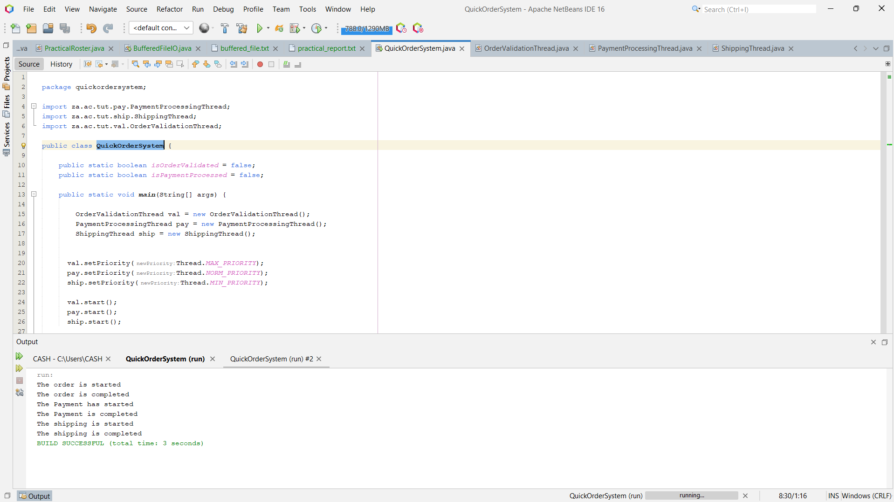

## Java Thread Synchronization Example
A simple Java demonstration of thread synchronization, lifecycle states, and deadlock prevention using an order processing system analogy.

## Project Overview
This project simulates a multi-threaded order processing system with three main components:

Order Validation (Highest priority thread)

Payment Processing (Normal priority thread)

Shipping (Lowest priority thread)

The system demonstrates proper thread synchronization to ensure operations execute in the correct sequence: Validation → Payment → Shipping.

## Learning Objectives
This code serves as an educational example for understanding:

How threads transition between different states

Proper use of synchronization mechanisms

Preventing race conditions and deadlocks

Thread priority management

Inter-thread communication patterns
## Sample Output

## Sample Output
The order is started
The order is completed
The Payment has started
The Payment is completed
The shipping is started
The shipping is completed
